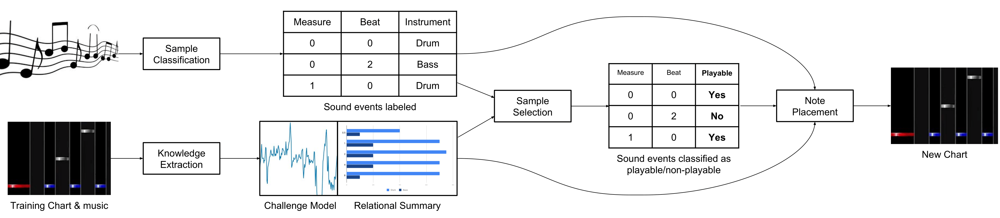

# GenerationMania
## Introduction
GenerationMania is an experimental framework for generating keysounded rhythm action game stages (For example, BMS charts) from sequence files (audio sample - timestamp pairs), featured in the paper "GenerationMania: Learning to Semantically Choreograph".

    

This repository contains the code used to produce the dataset and results in the paper. You can also try the "mix two charts" option to create your very own chart.

The main entry script provides utilities for you to build the dataset from your own BMS data, training the models, evaluate them, and generate new charts. However, you can also download the dataset we have pre-generated in the link listed in the Pretrained dataset section.

We are working on supporting other formats of input/output files, and other features. Stay tuned!

Please email me with any issues: zhiyulin [@at@] gatech (.dot.) edu

## Known issues
- Tensorflow-gpu won't import unless you have CUDA 9.0 installed and set as the default cuda (symlinked to cuda/). May fallback to tensorflow (disallow gpu acceleration) later.
- Currently BMS file with audio file references to a subfolder is not yet supported. 

## Guide
To start, do the following:

[Install CUDA 9.0]

[Read DEPENDENCIES if you encounter any other import error]

`pip install pipenv`

`(sudo) pipenv install`
- Depending on your enviromnent, try with or without `sudo`.

`pipenv shell`

`python3 main.py`
- First startup will take a while. `matplotlib` may have to initialize its font.

[Follows the on-screen prompt]

## Pretrained datasets

We have generated a pretrained dataset if you would like to skip generating it from raw BMS datasets..
This dataset is generated from BOF2011 dataset.

Download it from here:

https://drive.google.com/file/d/1b_tQCDiI9ftCLAWxMNan3XyYxd9EEtnC/view?usp=sharing

After you finished downloading, unzip it and put all the extracted contents in `traindata/` and go directly to training step.

## Attribution
If you use this framework or dataset in your research, please consider citing via the following BibTex:

    @article{lin2018generationmania,
      title={GenerationMania: Learning to Semantically Choreograph},
      author={Lin, Zhiyu and Xiao, Kyle and Riedl, Mark},
      journal={arXiv preprint arXiv:1806.11170},
      year={2018}
    }

## Frequently Asked Questions
Q: 
A:
