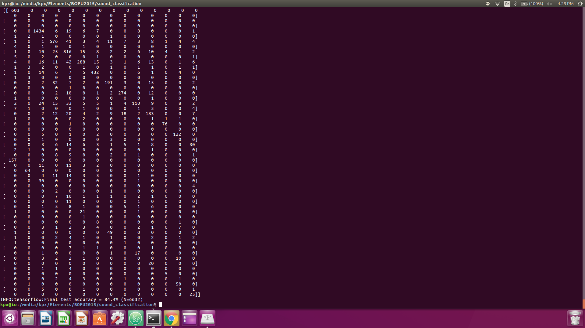

# Sound Classification

Convolutional sound classification NN currently based on speech net model from <a href="https://github.com/tensorflow/tensorflow/tree/master/tensorflow">Tensorflow docs</a>, trained on electronic instrument samples.

## Test Usage:
```bash
$ python label.py
dmset (score = 0.58643)
fx (score = 0.34933)
ogg (score = 0.05661)
```
* By default, targets sound file with "sample" in name (e.g. "sample.mp3") and reformats into a mono 16K bitrate wav format
* Feeds audio sample into pretrained model (based on "drm_mrg_forrrrbidden")
* Current sample is an <a href="http://audiosoundclips.com/audio-sound-clips-drums/">unrelated drumset loop</a>

## Training:
```bash
$ python train.py --wanted_words=subsynth,synth,bass,breakbeats,cutup,dmset,fx,kick,siren,ogg
```
* By default, trained with 18,000 training steps, learning rate of 0.001, and a 10% testing set
* Model:<br/>
     (fingerprint_input)<br/>
          v<br/>
      [Conv2D]&lt;-(weights)<br/>
          v<br/>
      [BiasAdd]&lt;-(bias)<br/>
          v<br/>
        [Relu]<br/>
          v<br/>
      [MaxPool]<br/>
          v<br/>
      [Conv2D]&lt;-(weights)<br/>
          v<br/>
      [BiasAdd]&lt;-(bias)<br/>
          v<br/>
        [Relu]<br/>
          v<br/>
      [MaxPool]<br/>
          v<br/>
      [MatMul]&lt;-(weights)<br/>
          v<br/>
      [BiasAdd]&lt;-(bias)<br/>
          v<br/>
          <br/>
* Training accuracy + Confusion Matrix:

          
## Plans:
* Restructuring model by introducing an recurrent step on fingerprint inputs
* Experimentation with LSTMs
* Unsupervised approach for distinguishing a feature set
